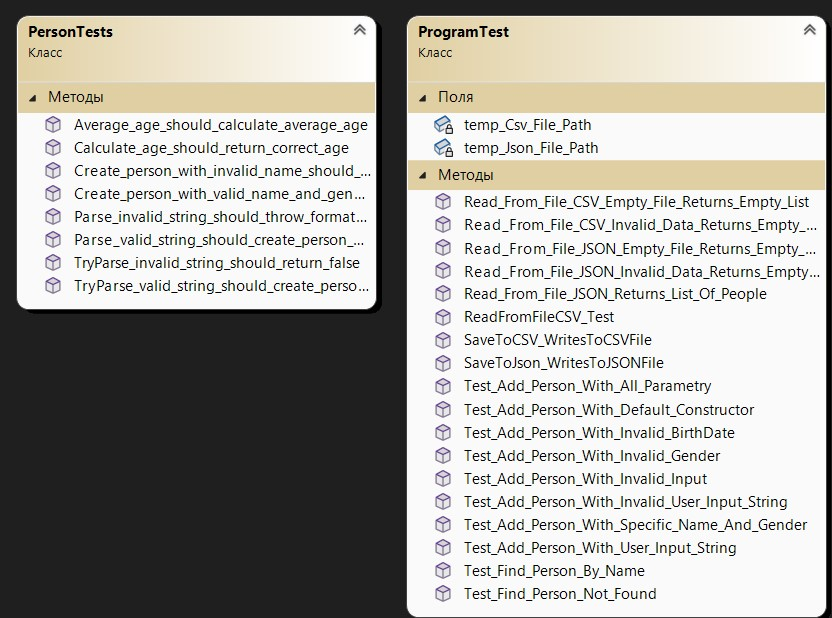
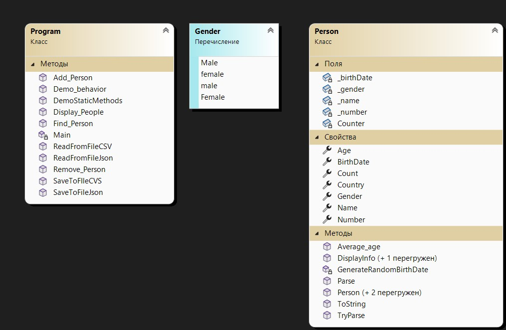

# Laba_7_Horbach_program

**З дисципліни:** «ООП»

**На тему:** « Saving and loading of objects. Serialization/ Deserialization »
## ПОСТАНОВКА ЗАДАЧІ
**Завдання:**

**На основі отриманого на лекції 7 теоретичного матеріалу скорегувати програму для лабораторної роботи № 6 наступним чином:**
1. В основній програмі додати методи для збереження (серіалізації) колекції List<T> об’єктів предметної області у файли з форматом .csv (.txt) та .json, а також методи для читання (десеріалізації) колекції з відповідних файлів.

   - Якщо у класі предметної області реалізований метод ToString() перетворює об’єкт на рядок, в якому всі значення розділенні комою, то обрати формат *.csv, інакше – *.txt.

2. Модифікувати меню таким чином (з’являються нові пункти!):
   
   1 - додати об’єкт

   2 - вивести на екран об’єкти

   3 - знайти об’єкт
 
   4 - видалити об’єкт

   5 - демонстрація поведінки об’єктів
 
   6 - демонстрація роботи static методів

   7 - зберегти колекцію об’єктів у файлі

   8 - зчитати колекцію об’єктів з файлу

   9 - очистити колекцію об’єктів

   0 - вийти з програми
   
У пункті меню «7 – зберегти колекцію об’єктів у файлі» необхідно реалізувати підменю:
```markdown
   1. зберегти у файл *.csv (*.txt)
   2. зберегти у файл *.json 
   ```
У пункті меню «8 – зчитати колекцію об’єктів з файлу» необхідно реалізувати підменю:
```markdown
   1. зчитати з файлу *.csv (*.txt) 
   2.зчитати з файлу *.json
   ```

Якщо на момент зчитування з файлу у колекції List<T> є наявні об’єкти, то десеріалізовані об’єкти мають додаватися до списку.

До колекції List<T> об’єктів додаємо тільки коректно десеріалізовані об’єкти, інші – пропускаємо.

3. Для нових/перероблених методів додати/скорегувати unit-тести.

4. Запустити виконання всіх наявних unit-тестів (як нових, так і з попередньої лабораторної роботи) і досягти повного їх проходження.

5. Детально протестувати програму. Мають бути протестовані 7-9 пункти меню. При тестуванні десеріалізації перевіряємо процес перетворення не тільки на коректних файлах *.csv (*.txt) і *.json, а також не забуваємо перевірити і файли з пропущеними даними і невірними типами даних.

6. Оформити звіт:

   ─ Титульний аркуш
   
   ─ Завдання
   
   ─ Діаграма класів** (**для основного проєкту і тест-проєкту)
   
   ─ Реалізація класу

   ─ Реалізація тест-класів
   
   ─ Код програми Program.cs
   
   ─ Результати запуску всіх unit-тестів
   ─ Результати детального тестування функціональності програми (навести скріншоти виконання тестування програми або скопіювати і вставити у звіт вивід програми 
     на екран)

# ВИКОНАННЯ РОБОТИ

**Загальні відомості**

Мова програмування - С#

Операційна система - Windows 11 Home PL

Тип процесора - Intel(R) Core(TM) i5-1035G1 CPU @ 1.00GHz   1.20 GHz

Тип компілятора - Visual Studio 2022

#ДІАГРАМА КЛАСІВ





# Опис вхідних і вихідних даних програми

**Вхідні данні:**

maxObjects – змінна out int типу, максимальна кількість об’єктів;

name – змінна типу string, що зберігає ім’я доданого об’єкту;

gender – змінна типу Gender , що зберігає стать доданого об’єкту;

birthDate– змінна типу DateTime, що зберігає дату народження доданого об’єкту;

number– змінна типу string, що зберігає номер телефону доданого об’єкту;

**Вихідні данні:**

people – список типу List<Person> , що зберігає в собі додані об’єкти;

**Опис функцій:**

public Person() – це метод класу, який викликається при створенні нового об'єкта класу;

public string Name – це метод типу string, що дозволяє отримувати та встановлювати ім'я студента як рядок типу string;

public DateTime BirthDate – це метод типу DateTime, який дозволяє читати та записувати значення _birthDate як об'єкт типу DateTime;

public Gender Gender – це метод типу Gender, який дозволяє читати та записувати значення Gender об'єкта типу Person;

public string Number – це метод типу string,який дозволяє читати та записувати значення номеру телефону об'єкта типу Person;

public int Age – це властивість типу int,яка дозволяє отримувати вік об'єкта на основі дати народження;

public string Country – це автовластивість типу string, яка  за замовчуванням ініціалізується значенням "Ukraine";

public void DisplayInfo() – це метод типу void,призначений для вводу інформації на екран.

public static void Add_Person() – це метод, який додає новий об'єкт до списку;

public static void Remove_Person() – це метод, який вилучає об'єкт зі cписку;

public static void Find_Person() – це метод, який шукає об'єкта у списку за вказаною характеристикою та значенням;

public static void Display_People() – це метод, який відображає інформацію про всі об'єкти у списку;

public static void Demo_behavior() – це метод, який демонструє поведінку об'єкта, дозволяючи користувачеві вибрати об'єкт і відобразити інформацію про нього з додатковими параметрами та без них;

public static void DemoStaticMethods() – це метод, який демонструє роботу статичного методу, який обчислює середній вік об'єктів у списку.

public static void SaveToFIleCVS() – це метод, який перетворює кожен об'єкт типу Person у рядок CSV і записує їх у файл;

public static void SaveToFileJson() – це метод, який зберігає інформацію зісписку (List) об'єктів у файл у форматі JSON;

public static List<Person> ReadFromFileJson() – це метод, який зчитує інформацію з файлу у форматі JSON і повертає її у вигляді списку об'єктів типу Person;

public static List<Person> ReadFromFileCSV() – це метод, який зчитує інформацію з файлу у форматі CSV і повертає її у вигляді списку об'єктів типу Person;

# РЕАЛІЗАЦІЯ КЛАСУ

**Rerson**
```markdown
using System;
using System.Collections.Generic;
using System.Globalization;
using System.Text.Json;
using System.Text.Json.Serialization;
using System.Xml.Linq;
namespace Laba_7_Horbach_program
{
    public class Person
    {
        private string? _name;
        private Gender _gender;
        private DateTime _birthDate;
        private string? _number;
        private static int Counter = 0;
        public Person()
        {
            Name = "Name";
            Gender = Gender.Male;
            BirthDate = GenerateRandomBirthDate();
            Number = "48538353801";
            Counter++;
        }
        public Person(string name, Gender gender) : this()
        {
            Name = name;
            Gender = gender;
        }
        public Person(string name, Gender gender, DateTime birthDate, string number)
        {
            Name = name;
            Gender = gender;
            BirthDate = birthDate;
            Number = number;
            Counter++;
        }
        public string? Name
        {
            get { return _name; }
            set
            {
                if (!string.IsNullOrEmpty(value) && value.Length >= 3 && value.All(char.IsLetter))
                {
                    _name = value;
                }
                else
                {
                    _name = "Name";
                }
            }
        }
        public DateTime BirthDate
        {
            get { return _birthDate; }
            set
            {
                if (value >= new DateTime(1958, 1, 1) && value <= new DateTime(2006, 12, 31))
                {
                    _birthDate = value;
                }
                else
                {
                    throw new ArgumentException("Некорректная дата рождения.");
                }
            }
        }
        private DateTime GenerateRandomBirthDate()
        {
            Random random = new Random();
            int year = random.Next(1958, 2007);
            int month = random.Next(1, 13);
            int day = random.Next(1, DateTime.DaysInMonth(year, month) + 1);
            return new DateTime(year, month, day);
        }
        [JsonConverter(typeof(JsonStringEnumConverter))]
        public Gender Gender { get; set; }
        public string? Number
        {
            get { return _number; }
            set
            {
                bool isValid = false;
                do
                {
                    if (!string.IsNullOrEmpty(value) && value.Length == 11 && value.All(char.IsDigit))
                    {
                        _number = value;
                        isValid = true;
                    }
                    else
                    {
                        Console.WriteLine("Некоректний номер телефону. Повторіть спробу.");
                        value = Console.ReadLine();
                    }
                } while (!isValid);
            }
        }
        public string Country { get; set; } = "Ukraine";
        public void DisplayInfo()
        {
            Console.WriteLine($"Ім'я: {_name}");
            Console.WriteLine($"Стать: {Gender}");
            Console.WriteLine($"Дата народження: {_birthDate:dd.MM.yyyy}");
            Console.WriteLine($"Номер телефону: {_number}");
            Console.WriteLine($"Країна: {Country}");
            Console.WriteLine($"Вік: {Age} years old");
        }
        public void DisplayInfo(string additionalInfo)
        {
            Console.WriteLine($"Ім'я: {_name}");
            Console.WriteLine($"Стать: {Gender}");
            Console.WriteLine($"Дата народження: {_birthDate:dd.MM.yyyy}");
            Console.WriteLine($"Номер телефону: {_number}");
            Console.WriteLine($"Країна: {Country}");
            Console.WriteLine($"Вік: {Age} years old");
            Console.WriteLine($"Додаткова информация: {additionalInfo}");
        }
        public static double Average_age(List<Person> people)
        {
            if (people.Count == 0)
            {
                return 0;
            }
            int Average_Age = 0;
            foreach (var person in people)
            {
                Average_Age += person.Age;
            }
            return (double)Average_Age / people.Count;
        }
        public int Age
        {
            get
            {
                var today = DateTime.Today;
                var age = today.Year - BirthDate.Year;
                if (BirthDate.Date > today.AddYears(-age)) age--;
                return age;
            }
        }
        // Зберігання кількості створених об’єктів предметної області
        public static int Count
        {
            get { return Counter; }
        }
        public static Person Parse(string s)
        {
            string[] parts = s.Split(';');
            if (parts.Length != 4)
            {
                throw new FormatException("Invalid format for parsing.");
            }
            string name = parts[0];
            Gender gender = (Gender)Enum.Parse(typeof(Gender), parts[1]);
            DateTime birthDate = DateTime.ParseExact(parts[2], "dd.MM.yyyy", CultureInfo.InvariantCulture);
            string number = parts[3];
            return new Person(name, gender, birthDate, number);
        }
        public static bool TryParse(string s, out Person? obj)
        {
            obj = null;
            try
            {
                obj = Parse(s);
                return true;
            }
            catch (FormatException)
            {
                return false;
            }
        }
        public override string ToString()
        {
            string genderString = Gender.ToString();
            return $"{_name},{genderString},{_birthDate:dd.MM.yyyy},{_number}";
        }
    }
}
```

# РЕАЛІЗАЦІЯ ТЕСТ-КЛАСУ

**PersonTest**
```markdown
using Laba_5_Horbach_program; 
namespace TestProject
{
    [TestClass]
    public class PersonTests
    {
        [TestMethod]
        public void Create_person_with_valid_name_and_gender_should_succeed()
        {
            // Arrange
            string name = "Lukas";
            Gender gender = Gender.Male;
            // Act
            Person person = new Person(name, gender);
            // Assert
            Assert.AreEqual(name, person.Name);
            Assert.AreEqual(gender, person.Gender);
        }
        [TestMethod]
        public void Create_person_with_invalid_name_should_set_default_name()
        {
            // Arrange
            string invalid_name = "N2"; 
            Gender gender = Gender.Male;
            // Act
            Person person = new Person(invalid_name, gender); 
            // Assert
            Assert.AreEqual("Name", person.Name); 
        }
        [TestMethod]
        public void Calculate_age_should_return_correct_age()
        {
            // Arrange
            DateTime birth_date = new DateTime(1990, 5, 15);
            Person person = new Person("Mike", Gender.Female, birth_date, "48536232901");
            // Act
            int age = person.Age; 
            // Assert
            Assert.AreEqual(33, age); 
        }
        [TestMethod]
        public void Parse_valid_string_should_create_person_object()
        {
            // Arrange
            string personString = "Arina;female;24.11.2004;48538353801"; 
            // Act
            Person person = Person.Parse(personString); 
            // Assert
            Assert.AreEqual("Arina", person.Name);
            Assert.AreEqual(Gender.female, person.Gender);
            Assert.AreEqual(new DateTime(2004, 11, 24), person.BirthDate);
            Assert.AreEqual("48538353801", person.Number);
        }
        [TestMethod]
        public void TryParse_valid_string_should_create_person_object()
        {
            // Arrange
            string person_string = "Seyran;Female;22.12.2003;48536353802"; 
            Person parsed_person;
            // Act
            bool result = Person.TryParse(person_string, out parsed_person);
            // Assert
            Assert.IsTrue(result, "TryParse should return true"); 
            Assert.IsNotNull(parsed_person, "Parsed Person should not be null");
            Assert.AreEqual("Seyran", parsed_person.Name); 
            Assert.AreEqual(Gender.Female, parsed_person.Gender);
            Assert.AreEqual(new DateTime(2003, 12, 22), parsed_person.BirthDate);
            Assert.AreEqual("48536353802", parsed_person.Number);
        }
        [TestMethod]
        public void TryParse_invalid_string_should_return_false()
        {
            // Arrange
            string invalid_person_string = "AfraMert";
            Person parsed_person;
            // Act
            bool result = Person.TryParse(invalid_person_string, out parsed_person);
            // Assert
            Assert.IsFalse(result, "TryParse should return false for invalid input");
            Assert.IsNull(parsed_person, "Parsed Person should be null for invalid input");
        }
        [TestMethod]
        public void Parse_invalid_string_should_throw_format_exception()
        {
            // Arrange
            string invalid_person_string = "Invalid";
            // Act and Assert
            Assert.ThrowsException<FormatException>(() => Person.Parse(invalid_person_string), "Parse should throw FormatException for invalid input");
        }
        [TestMethod]
        public void Average_age_should_calculate_average_age()
        {
            // Arrange
            var people = new List<Person>
            {
                new Person("Person1", Gender.Male, new DateTime(1997, 9, 1), "48536725401"),
                new Person("Person2", Gender.Female, new DateTime(1985, 3, 15), "48536999801"),
                new Person("Person3", Gender.Male, new DateTime(1995, 5, 20), "48532636802"),
            };
            // Act
            double average_age = Person.Average_age(people);
            // Assert
            Assert.AreEqual(30.66, average_age, 2);
        }
    }
}
```

**ProgramTest**
```markdown
using Microsoft.VisualStudio.TestTools.UnitTesting;
using System;
using System.Collections.Generic;
using Laba_7_Horbach_program;
namespace TestProject
{
    [TestClass]
    public class ProgramTest
    {
        [TestMethod]
        public void Test_Add_Person_With_Default_Constructor()
        {
            // Arrange
            List<Person> people = new List<Person>();
            int maxObjects = 5;
            // Act
            using (StringReader sr = new StringReader("1\n1\n"))
            {
                Console.SetIn(sr);
                Program.Add_Person(people, maxObjects);
            }
            // Assert
            Assert.AreEqual(1, people.Count);
        }
        [TestMethod]
        public void Test_Add_Person_With_Specific_Name_And_Gender()
        {
            // Arrange
            List<Person> people = new List<Person>();
            int maxObjects = 5;
            // Act
            Console.SetIn(new System.IO.StringReader("1\n2\nAlice\nFemale\n"));
            global::Program.Add_Person(people, maxObjects);
            // Assert
            Assert.AreEqual(1, people.Count);
        }
        [TestMethod]
        public void Test_Add_Person_With_Invalid_Gender()
        {
            // Arrange
            List<Person> people = new List<Person>();
            int maxObjects = 5;
            // Act
            Console.SetIn(new System.IO.StringReader("1\n2\nAlice\nInvalidGender\n"));
            global::Program.Add_Person(people, maxObjects);
            // Assert
            Assert.AreEqual(0, people.Count);
        }
        [TestMethod]
        public void Test_Add_Person_With_All_Parametry()
        {
            // Arrange
            List<Person> people = new List<Person>();
            int maxObjects = 5;
            using (StringReader sr = new StringReader("1\n3\nJohn\nMale\n01.01.1990\n48538626501\n"))
            {
                Console.SetIn(sr);
                // Act
                Program.Add_Person(people, maxObjects);
                // Assert
                Assert.AreEqual(1, people.Count);
                // Перевірка інших атрибутів створеного об'єкта (ім'я, стать, дата народження, номер телефону)
                var addedPerson = people[0];
                Assert.AreEqual("John", addedPerson.Name);
                Assert.AreEqual(Gender.Male, addedPerson.Gender);
                Assert.AreEqual(new DateTime(1990, 1, 1), addedPerson.BirthDate);
                Assert.AreEqual("48538626501", addedPerson.Number);
            }
        }
        [TestMethod]
        public void Test_Add_Person_With_Invalid_BirthDate()
        {
            // Arrange
            List<Person> people = new List<Person>();
            int maxObjects = 5;
            using (StringReader sr = new StringReader("1\n3\nSeyran\nFemale\nInvaliedBirthDate\n48538626501\n"))
            {
                Console.SetIn(sr);
                // Act
                Program.Add_Person(people, maxObjects);
                // Assert
                Assert.AreEqual(0, people.Count);
            }
        }
        [TestMethod]
        public void Test_Add_Person_With_Invalid_Input()
        {
            // Arrange
            List<Person> people = new List<Person>();
            int maxObjects = 5;
            // Act
            using (StringReader sr = new StringReader("1\n3\nFerit\nmale\nInvalidBirthDate\n48538602101\n"))
            {
                Console.SetIn(sr);
                Program.Add_Person(people, maxObjects);
            }
            // Assert
            Assert.AreEqual(0, people.Count);
        }
        [TestMethod]
        public void Test_Add_Person_With_User_Input_String()
        {
            // Arrange
            List<Person> people = new List<Person>();
            int maxObjects = 5;
            // Act
            Console.SetIn(new System.IO.StringReader("2\nAlice;Female;01.01.1990;48538353801\n"));
            global::Program.Add_Person(people, maxObjects);
            // Assert
            Assert.AreEqual(1, people.Count);
        }
        [TestMethod]
        public void Test_Add_Person_With_Invalid_User_Input_String()
        {
            // Arrange
            List<Person> people = new List<Person>();
            int maxObjects = 5;
            // Act
            Console.SetIn(new System.IO.StringReader("2\nInvalidInput\n"));
            global::Program.Add_Person(people, maxObjects);
            // Assert
            Assert.AreEqual(0, people.Count);
        }
        [TestMethod]
        public void Test_Find_Person_By_Name()
        {
            // Arrange
            List<Person> people = new List<Person>
            {
                new Person("John", Gender.Male),
                new Person("Alice", Gender.Female)
            };
            string expectedName = "John";
            // Act
            using (StringReader sr = new StringReader($"Name\n{expectedName}\n"))
            {
                Console.SetIn(sr);
                using (StringWriter sw = new StringWriter())
                {
                    Console.SetOut(sw);
                    Program.Find_Person(people);
                    string output = sw.ToString();
                    // Assert
                    Assert.IsTrue(output.Contains("Результат пошуку:"));
                    Assert.IsTrue(output.Contains(expectedName));
                }
            }
        }
        [TestMethod]
        public void Test_Find_Person_Not_Found()
        {
            // Arrange
            List<Person> people = new List<Person>
            {
                new Person("John", Gender.Male),
                new Person("Alice", Gender.Female)
            };
            string searchValue = "UnknownName";
            // Act
            using (StringReader sr = new StringReader($"Name\n{searchValue}\n"))
            {
                Console.SetIn(sr);
                using (StringWriter sw = new StringWriter())
                {
                    Console.SetOut(sw);
                    Program.Find_Person(people);
                    string output = sw.ToString();
                    // Assert
                    Assert.IsTrue(output.Contains("Об'єкт, який відповідає умові пошуку, не знайдено."));
                }
            }
        }
        private static string tempCsvFilePath = "temp_test.csv";
        private static string tempJsonFilePath = "temp_test.json";
        [TestMethod]
        public void SaveToCSV_WritesToCSVFile()
        {
            // Arrange
            List<Person> people = new List<Person>
            {
                new Person("John", Gender.Male),
                new Person("Alice", Gender.Female)
            };
            // Act
            Program.SaveToFIleCVS(people, tempCsvFilePath);
            // Assert
            Assert.IsTrue(File.Exists(tempCsvFilePath), "The CSV file should have been created.");
            // Clean up
            File.Delete(tempCsvFilePath);
        }
        [TestMethod]
        public void SaveToJson_WritesToJSONFile()
        {
            // Arrange
            List<Person> people = new List<Person>
            {
                new Person("John", Gender.Male),
                new Person("Alice", Gender.Female)
            };
            // Act
            Program.SaveToFileJson(people, tempJsonFilePath);
            // Assert
            Assert.IsTrue(File.Exists(tempJsonFilePath), "The JSON file should have been created.");
            // Clean up
            File.Delete(tempJsonFilePath);
        }
        [TestMethod]
        public void Read_From_File_JSON_Returns_List_Of_People()
        {
            // Arrange
            File.WriteAllText(tempJsonFilePath, "{\"Name\":\"John\",\"Gender\":\"Male\"}\n{\"Name\":\"Alice\",\"Gender\":\"Female\"}");
            // Act
            List<Person> people = Program.ReadFromFileJson(tempJsonFilePath);
            // Assert
            Assert.AreEqual(2, people.Count);
            Assert.AreEqual("John", people[0].Name);
            Assert.AreEqual("Alice", people[1].Name);
            // Clean up
            File.Delete(tempJsonFilePath);
        }
    }
}
```

# Код програми Program.cs
```markdown
using Laba_7_Horbach_program;
using System;
using System.Collections.Generic;
using System.Reflection;
using System.Text;
using System.Text.Json;
using System.Xml.Linq;
public class Program
{
    static void Main(string[] args)
    {
        Console.OutputEncoding = Encoding.UTF8;
        Console.Write("Введіть максимальну кількість користувачів (N): ");
        if (int.TryParse(Console.ReadLine(), out int max_objects) && max_objects > 0)
        {
            Console.WriteLine($"Максимальна кількість користувачів: {max_objects}");
            List<Person> people = new();
            while (true)
            {
                Console.WriteLine("\nМеню:");
                Console.WriteLine("1 - Додати об’єкт");
                Console.WriteLine("2 - Вивести на екран об’єкти");
                Console.WriteLine("3 - Знайти об’єкт");
                Console.WriteLine("4 - Видалити об’єкт");
                Console.WriteLine("5 - Демонстрація поведінки об’єктів");
                Console.WriteLine("6 - Демонстрація роботи static методів");
                Console.WriteLine("7 - зберегти колекцію об’єктів у файлі");
                Console.WriteLine("8 - зчитати колекцію об’єктів з файлу");
                Console.WriteLine("9 - очистити колекцію об’єктів");
                Console.WriteLine("0 - Вийти з програми");
                Console.Write("Виберіть опцію: ");
                if (int.TryParse(Console.ReadLine(), out int choice))
                {
                    try
                    {
                        switch (choice)
                        {
                            case 1:
                                Add_Person(people, max_objects);
                                break;
                            case 2:
                                Display_People(people);
                                break;
                            case 3:
                                Find_Person(people);
                                break;
                            case 4:
                                Remove_Person(people);
                                break;
                            case 5:
                                Demo_behavior(people);
                                break;
                            case 6:
                                DemoStaticMethods(people);
                                break;
                            case 7:
                                Console.WriteLine("1 – зберегти у файл *.csv (*.txt)");
                                Console.WriteLine("2 – зберегти у файл *.json");
                                int answer = int.Parse(Console.ReadLine());
                                switch (answer)
                                {
                                    case 1:
                                        string csvFilePath = @"C:\Users\Arina Gorbach\Desktop\Lab_7.csv"; 
                                        SaveToFIleCVS(people, csvFilePath);
                                        Console.WriteLine("Data loaded into a CSV file.");
                                        break;
                                    case 2:
                                        string jsonFilePath = @"C:\Users\Arina Gorbach\Desktop\Lab_7.json";
                                        SaveToFileJson(people, jsonFilePath);
                                        Console.WriteLine("Data loaded into JSON file.");
                                        break;
                                    default:
                                        Console.WriteLine("Некоректний вибір способу зберігання.");
                                        break;
                                }
                                break;
                            case 8:
                                Console.WriteLine("1 – зчитати з файлу *.csv (*.txt)");
                                Console.WriteLine("2 – зчитати з файлу *.json");
                                int answer_1 = int.Parse(Console.ReadLine());
                                switch (answer_1)
                                {
                                    case 1:
                                        string readCVSFile = @"C:\Users\Arina Gorbach\Desktop\Lab_7.csv";
                                        people = ReadFromFileCSV(readCVSFile); 
                                        Console.WriteLine("Data loaded from CSV file.");
                                        break;
                                    case 2:
                                        string readJsonFile = @"C:\Users\Arina Gorbach\Desktop\Lab_7.json";
                                        people = ReadFromFileJson(readJsonFile); 
                                        Console.WriteLine("Data loaded from JSON file.");
                                        break;
                                    default:
                                        Console.WriteLine("Некоректний вибір способу завантаження.");
                                        break;
                                }
                                break;
                            case 9:
                                people.Clear();
                                break;
                            case 0:
                                Console.WriteLine("Завершення роботи програми.");
                                return;
                            default:
                                Console.WriteLine("Некоректний вибір опції.");
                                break;
                        }
                    }
                    catch (Exception ex)
                    {
                        Console.WriteLine($"Помилка: {ex.Message}");
                    }
                }
                else
                {
                    Console.WriteLine("Некоректний вибір опції.");
                }
            }
        }
        else
        {
            Console.WriteLine("Некоректне значення для максимальної кількості користувачів.");
        }
    }
    public static void Add_Person(List<Person> people, int max_objects)
    {
        if (people.Count < max_objects)
        {
            Console.Write("1 - використання конструкторів, 2 - В форматі: Name,Gender,BirthDate,Number\n");
            int answer = int.Parse(Console.ReadLine());
            switch (answer)
            {
                case 1:
                    {
                        Console.WriteLine("Оберіть конструктор: 1 - без параметрів, 2 - заповнити ім'я та стать, 3 - всі параметри");
                        int constructor = int.Parse(Console.ReadLine());
                        switch (constructor)
                        {
                            case 1:
                                Person person = new Person();
                                people.Add(person);
                                Console.Write("Об'єкт додано");
                                break;
                            case 2:
                                Console.Write("Введіть ім'я: ");
                                string name = Console.ReadLine();
                                Console.Write("Введіть стать (Male/Female): ");
                                if (Enum.TryParse(typeof(Gender), Console.ReadLine(), true, out object genderobj))
                                {
                                    Gender gender = (Gender)genderobj;
                                    Person personWithGender = new Person(name, gender);
                                    people.Add(personWithGender);
                                    Console.Write("Об'єкт додано");
                                }
                                else
                                {
                                    Console.WriteLine("Некоректна стать.");
                                }
                                break;
                            case 3:
                                Console.Write("Введіть ім'я: ");
                                string _name = Console.ReadLine();
                                Gender _gender = Gender.Male;
                                Console.Write("Введіть стать (Male/Female): ");
                                if (Enum.TryParse(typeof(Gender), Console.ReadLine(), true, out object _parsedGenderObj))
                                {
                                    _gender = (Gender)_parsedGenderObj;
                                    Console.Write("Введіть дату народження (dd.MM.yyyy): ");
                                    if (DateTime.TryParseExact(Console.ReadLine(), "dd.MM.yyyy", null, System.Globalization.DateTimeStyles.None, out DateTime birthDate))
                                    {
                                        Console.Write("Введіть номер телефону: ");
                                        string number = Console.ReadLine();
                                        Person personWithManualData = new Person(_name, _gender, birthDate, number);
                                        people.Add(personWithManualData);
                                        Console.Write("Об'єкт додано");
                                    }
                                    else
                                    {
                                        Console.WriteLine("Некоректна дата народження.");
                                    }
                                }
                                else
                                {
                                    Console.WriteLine("Некоректна стать.");
                                }
                                break;
                            default:
                                Console.WriteLine("Некоректний вибір конструктора.");
                                break;
                        }
                        break;
                    }
                case 2:
                    {
                        Console.Write("Введіть характеристики користувача в форматі: Name,Gender,BirthDate,Number:\n");
                        string inputString = Console.ReadLine();
                        if (Person.TryParse(inputString, out Person new_Person))
                        {
                            people.Add(new_Person);
                            Console.WriteLine("Об'єкт додано.");
                        }
                        else
                        {
                            Console.WriteLine("Некоректний формат вводу.");
                        }
                        break;
                    }
                default:
                    Console.WriteLine("Некоректний вибір");
                    break;
            }
        }
        else
        {
            Console.WriteLine("Досягнуто максимальну кількість об'єктів.");
        }
    }
    public static void Remove_Person(List<Person> people)
    {
        Console.WriteLine("Видалення об'єкта: ");
        Console.Write("Виберіть спосіб видалення (1 - за номером, 2 - за характеристикою): ");
        if (int.TryParse(Console.ReadLine(), out int deleteChoice))
        {
            switch (deleteChoice)
            {
                case 1:
                    Console.Write("Введіть номер об'єкта для видалення (1 - перший, 2 - другий і т.д.): ");
                    if (int.TryParse(Console.ReadLine(), out int deleteIndex) && deleteIndex > 0 && deleteIndex <= people.Count)
                    {
                        people.RemoveAt(deleteIndex - 1);
                        Console.WriteLine("Об'єкт видалено.");
                    }
                    else
                    {
                        Console.WriteLine("Некоректний номер об'єкта.");
                    }
                    break;
                case 2:
                    Console.Write("Введіть характеристику для видалення (Name/Gender/BirthDate/Number): ");
                    string deleteProperty = Console.ReadLine();

                    Console.Write($"Введіть значення для  {deleteProperty}: ");
                    string deleteValue = Console.ReadLine();

                    switch (deleteProperty)
                    {
                        case "Name":
                            people.RemoveAll(p => p.Name.Equals(deleteValue, StringComparison.OrdinalIgnoreCase));
                            break;
                        case "Gender":
                            if (Enum.TryParse(typeof(Gender), deleteValue, true, out object deleteGenderObj))
                            {
                                Gender deleteGender = (Gender)deleteGenderObj;
                                people.RemoveAll(p => p.Gender == deleteGender);
                            }
                            else
                            {
                                Console.WriteLine("Некоректна стать. ");
                            }
                            break;
                        case "BirthDate":
                            if (DateTime.TryParseExact(deleteValue, "dd.MM.yyyy", null, System.Globalization.DateTimeStyles.None, out DateTime deleteBirthDate))
                            {
                                people.RemoveAll(p => p.BirthDate == deleteBirthDate);
                            }
                            else
                            {
                                Console.WriteLine("Некоректна дата народження.");
                            }
                            break;
                        case "Number":
                            people.RemoveAll(p => p.Number.Equals(deleteValue));
                            break;
                        default:
                            Console.WriteLine("Некоректна характеристика для видалення.");
                            break;
                    }

                    Console.WriteLine("Об'єкти видалено. ");
                    break;
                default:
                    Console.WriteLine("Некоректний вибір способу видалення. ");
                    break;
            }
        }
        else
        {
            Console.WriteLine("Некоректний вибір способу видалення.");
        }
    }

    public static void Find_Person(List<Person> people)
    {
        Console.WriteLine("Пошук об'єкта:");
        Console.Write("Введіть характеристику для пошуку (Name/Gender/BirthDate/Number): ");
        string searchCharacteristic = Console.ReadLine();
        Console.Write($"Введіть значення для {searchCharacteristic}: ");
        string searchValue = Console.ReadLine();
        // Визначення умови пошуку
        Predicate<Person> condition = person =>
        {
            switch (searchCharacteristic)
            {
                case "Name":
                    return person.Name.Equals(searchValue, StringComparison.OrdinalIgnoreCase);
                case "Gender":
                    return person.Gender.ToString().Equals(searchValue, StringComparison.OrdinalIgnoreCase);
                case "BirthDate":
                    if (DateTime.TryParseExact(searchValue, "dd.MM.yyyy", null, System.Globalization.DateTimeStyles.None, out DateTime birthDate))
                    {
                        return person.BirthDate == birthDate;
                    }
                    return false;
                case "Number":
                    return person.Number.Equals(searchValue, StringComparison.OrdinalIgnoreCase);
                default:
                    return false;
            }
        };
        Person foundPerson = people.Find(condition);
        if (foundPerson != null)
        {
            Console.WriteLine("Результат пошуку:");
            foundPerson.DisplayInfo();
        }
        else
        {
            Console.WriteLine("Об'єкт, який відповідає умові пошуку, не знайдено.");
        }
    }
    public static void Display_People(List<Person> people)
    {
        if (people.Count == 0)
        {
            Console.WriteLine("Об'єктів ще не було додано.");
        }
        else
        {
            Console.WriteLine("Об'єкти:");
            for (int i = 0; i < people.Count; i++)
            {
                Console.WriteLine($"Об'єкт {i + 1}:");
                people[i].DisplayInfo();
                Console.WriteLine();
            }
        }
    }
    public static void Demo_behavior(List<Person> people)
    {
        Console.WriteLine("Демонстрація поведінки:");
        if (people.Count > 0)
        {
            Console.Write("Виберіть номер об'єкта для демонстрації: ");
            if (int.TryParse(Console.ReadLine(), out int demo_index) && demo_index > 0 && demo_index <= people.Count)
            {
                Console.WriteLine("Без параметрів:");
                people[demo_index - 1].DisplayInfo();
                Console.WriteLine("З параметром:");
                people[demo_index - 1].DisplayInfo($"Час реєстрації: {DateTime.Now:HH:mm:ss dd.MM.yyyy}");
            }
            else
            {
                Console.WriteLine("Некоректний номер об'єкта.");
            }
        }
        else
        {
            Console.WriteLine("Немає об'єктів для демонстрації.");
        }
    }
    public static void DemoStaticMethods(List<Person> people)
    {
        Console.WriteLine("Демонстрація роботи static методів:");
        if (people.Count > 0)
        {
            double average_age = Person.Average_age(people);
            Console.WriteLine($"Середній вік об'єктів: {average_age} років");
        }
        else
        {
            Console.WriteLine("Немає об'єктів для підрахунку середнього віку.");
        }
    }
    public  static void SaveToFIleCVS(List<Person> accounts, string path)
    {
        List<string> lines = new List<string>();
        foreach(var item in accounts)
        {
            lines.Add(item.ToString());
        }
        try
        {
            File.WriteAllLines(path, lines);
            Console.WriteLine($"Check out the CVS file.at: {Path.GetFullPath(path)}");
        }
        catch (IOException ex)
        {
            // Викидаємо IOException при помилці запису в файл.
            throw ex;
        }
        catch (Exception ex)
        {
            Console.WriteLine(ex.Message);
        }
    }
    public static void SaveToFileJson(List<Person> accounts, string path)
    {
        try
        {
            string jsonstring = "";
            foreach (var item in accounts)
            {
                jsonstring += JsonSerializer.Serialize<Person>(item);
                jsonstring += "\n";
            }
            File.WriteAllText(path, jsonstring);
            Console.WriteLine($"Cheak out the JSON file at: {Path.GetFullPath(path)}");
        }
        catch (Exception ex)
        {
            Console.WriteLine(ex.Message);
        }
    }
   public  static List<Person> ReadFromFileJson(string path)
    {
        List<Person> accounts = new List<Person>();
        try
        {
            List<string> lines = new List<String>();
            lines = File.ReadAllLines(path).ToList();
            Console.WriteLine("\nContents of JSON file:\n");
            foreach (var item in lines)
            {
                Console.WriteLine(item);
            }
            foreach (var item in lines)
            {
                Person? account = JsonSerializer.Deserialize<Person>(item);
                if (account != null) accounts.Add(account);
            }
        }
        catch (IOException ex)
        {
            Console.WriteLine($"Reading JSON file error:{ex.Message}");
        }
        catch (Exception ex)
        {
            Console.WriteLine(ex.Message);
        }
        return accounts;
    }
    public static List<Person> ReadFromFileCSV(string path)
    {
        List<Person> accounts = new List<Person>();
        try
        {
            List<string> lines = new List<string>();
            lines = File.ReadAllLines(path).ToList();
            Console.WriteLine("\nContents of CSV file: \n");
            foreach (var item in lines)
            {
                Console.WriteLine(item);
            }
            foreach (var item in lines)
            {
                Person? account;
                bool result = Person.TryParse(item, out account);
                if (result) accounts.Add(account);
            }
        }
        catch (IOException ex)
        {
            Console.WriteLine($"Reading CSV file error: {ex.Message}");
        }
        catch (Exception ex)
        {
            Console.WriteLine(ex.Message);
        }
        return accounts;
    }
}
```

# РЕЗУЛЬТАТИ ЗАПУСКУ РОЗРОБЛЕНИХ ТЕСТІВ

# РЕЗУЛЬТАТ РОБОТИ ПРОГРАМИ

